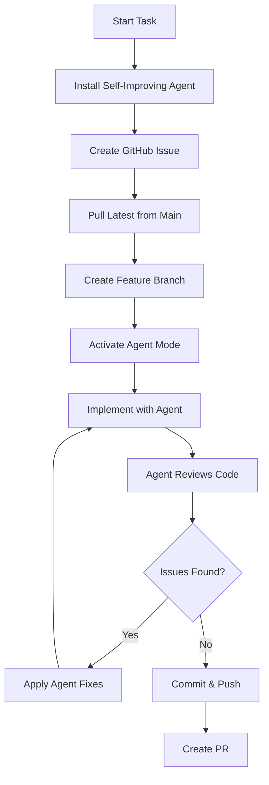

# Self-Improving Agent Setup

This document provides instructions for AI agents to install and use the self-improving agent skill for this project.

## Installation

### From Clawhub.ai

**Source:** https://clawhub.ai/pskoett/self-improving-agent

**Installation Steps:**

1. Visit the clawhub.ai URL
2. Install the self-improving agent skill
3. Configure for this project
4. Verify installation

```bash
# Installation command (to be provided)
# [Add specific installation steps here]
```

## What is the Self-Improving Agent?

The self-improving agent is a skill that enhances AI assistant capabilities for:

- **Code Generation**: Improved code quality and patterns
- **Problem Solving**: Iterative approach to complex problems
- **Learning**: Adapts to project-specific patterns
- **Self-Correction**: Identifies and fixes issues proactively
- **Optimization**: Suggests improvements and refactoring

## Usage

### When to Use

**Always use for:**
- Complex feature implementation
- Refactoring large code sections
- Solving difficult technical problems
- Performance optimization
- Architecture decisions

**Optional for:**
- Simple bug fixes
- Documentation updates
- Minor style changes

### How to Use

1. **Before Starting Work**
   ```bash
   # Activate self-improving agent mode
   # [Add activation command]
   ```

2. **During Development**
   - Agent analyzes code patterns
   - Suggests improvements
   - Identifies potential issues
   - Proposes optimizations

3. **After Implementation**
   - Review agent suggestions
   - Apply relevant improvements
   - Document learnings

## Integration with Project Workflow

### With GitHub Issues

1. Create GitHub Issue (as per collaboration rules)
2. Activate self-improving agent
3. Implement with agent assistance
4. Review and refine with agent
5. Create PR with improvements

### With Development Process



## Capabilities

### Code Analysis
- Pattern detection
- Anti-pattern identification
- Performance bottlenecks
- Security vulnerabilities

### Code Generation
- Follow project conventions
- Use established patterns
- Proper TypeScript types
- Comprehensive error handling

### Optimization
- Performance improvements
- Code simplification
- Better abstractions
- Reduced duplication

### Learning
- Project-specific patterns
- Team preferences
- Common solutions
- Best practices

## Configuration for AI Trading Platform

### Project-Specific Settings

**Framework Detection:**
- React + TypeScript + Vite (Web)
- NestJS + TypeScript (Backend)
- Yarn Workspaces (Monorepo)

**Code Style:**
- Follow existing patterns
- Use Tailwind CSS (web)
- Swagger documentation (backend)
- TypeScript strict mode

**Quality Standards:**
- No `any` types without justification
- Proper error handling
- Comprehensive Swagger docs
- Responsive design (web)

## Examples

### Example 1: Feature Implementation

```typescript
// Agent helps implement a new trading feature
// 1. Analyzes existing trading patterns
// 2. Suggests optimal structure
// 3. Generates initial code
// 4. Reviews and improves
// 5. Adds tests and documentation
```

### Example 2: Refactoring

```typescript
// Agent assists with refactoring
// 1. Identifies code smells
// 2. Proposes better structure
// 3. Ensures no breaking changes
// 4. Updates related code
// 5. Verifies functionality
```

### Example 3: Problem Solving

```typescript
// Agent helps solve complex issues
// 1. Analyzes the problem
// 2. Suggests multiple approaches
// 3. Evaluates trade-offs
// 4. Implements best solution
// 5. Validates correctness
```

## Memory Integration

The self-improving agent integrates with project memory:

**Location:** `/Users/[user]/.claude/projects/[project]/memory/`

**What to Store:**
- Common patterns learned
- Frequent issues and solutions
- Optimization strategies
- Project-specific conventions

**How Agent Uses Memory:**
1. Reads existing patterns on startup
2. Applies learned solutions
3. Updates memory with new learnings
4. Shares insights across sessions

## Troubleshooting

### Agent Not Working

1. Verify installation
2. Check activation command
3. Review error messages
4. Reinstall if necessary

### Agent Suggestions Don't Fit

1. Agent is learning project patterns
2. Provide feedback on suggestions
3. Agent will adapt over time
4. Override when necessary

### Performance Issues

1. Agent processing may take time
2. Complex analysis requires patience
3. Can disable for simple tasks
4. Re-enable for complex work

## Best Practices

### Do's
✅ Use agent for complex tasks
✅ Review agent suggestions carefully
✅ Provide feedback to improve
✅ Document learnings
✅ Share insights with team

### Don'ts
❌ Blindly accept all suggestions
❌ Use for trivial tasks
❌ Ignore human review
❌ Skip testing
❌ Forget to document

## Updates

**Check for updates regularly:**
```bash
# Update self-improving agent
# [Add update command]
```

**Stay current with:**
- New features
- Bug fixes
- Performance improvements
- Enhanced capabilities

---

**Last Updated:** 2026-03-23
**Agent Version:** [To be specified]
**Project:** AI Trading Platform

For questions about the self-improving agent, refer to:
- https://clawhub.ai/pskoett/self-improving-agent
- Project collaboration rules
- Team lead or maintainer
